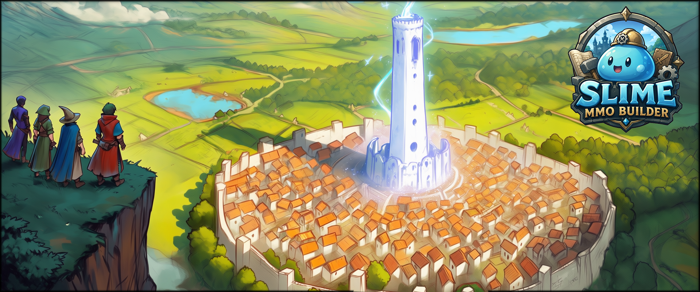
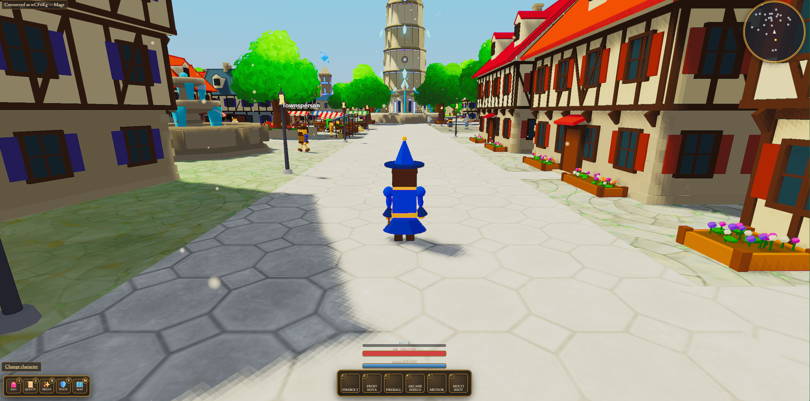
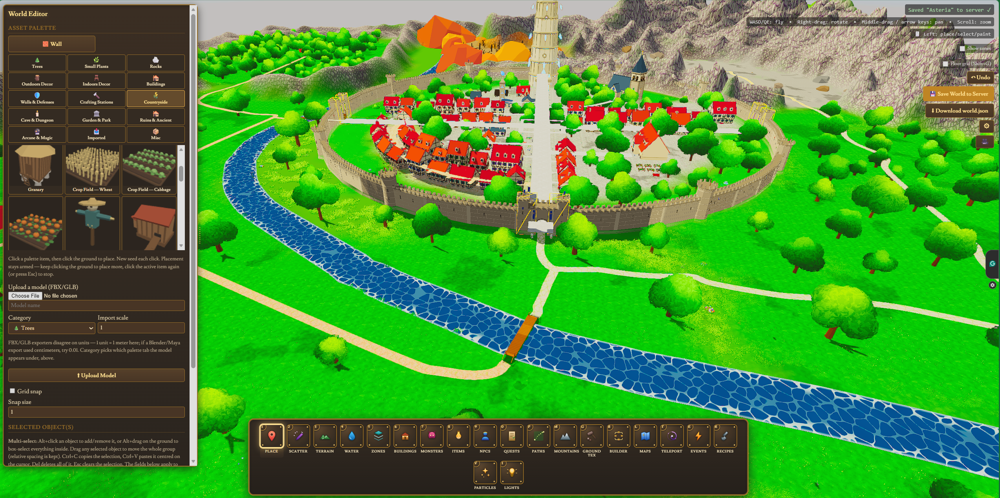
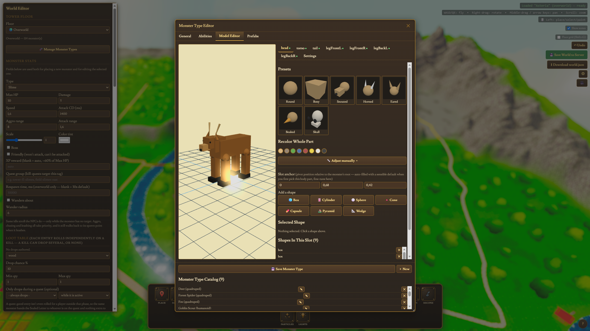
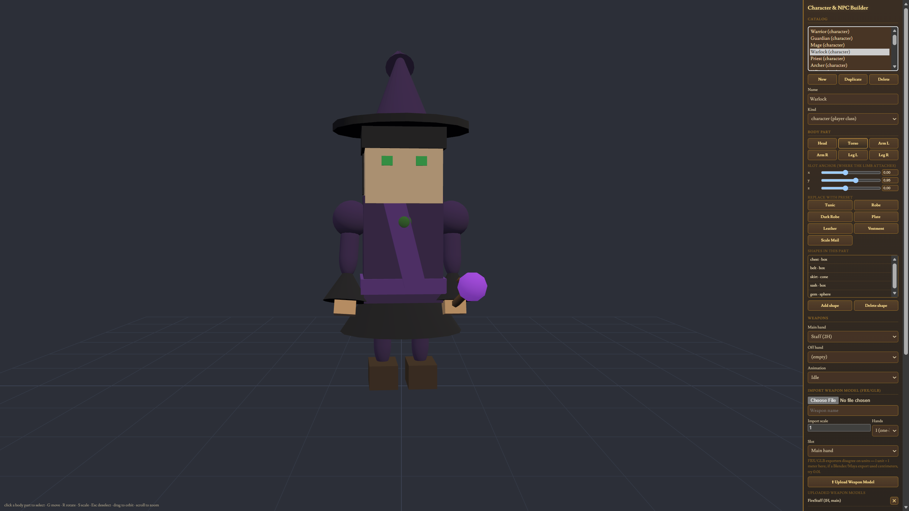
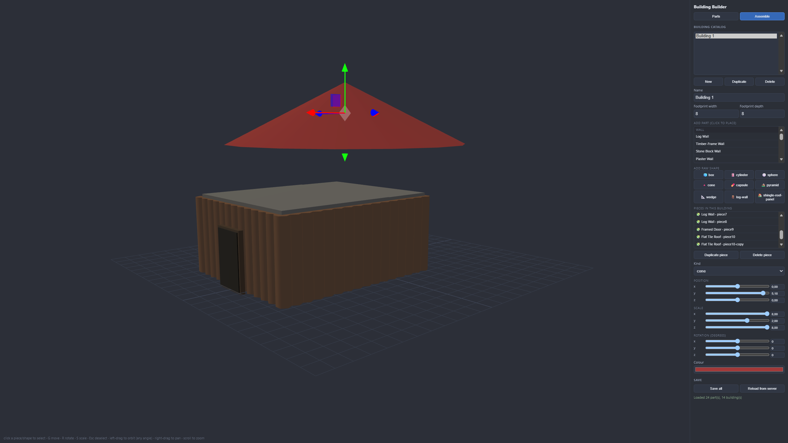
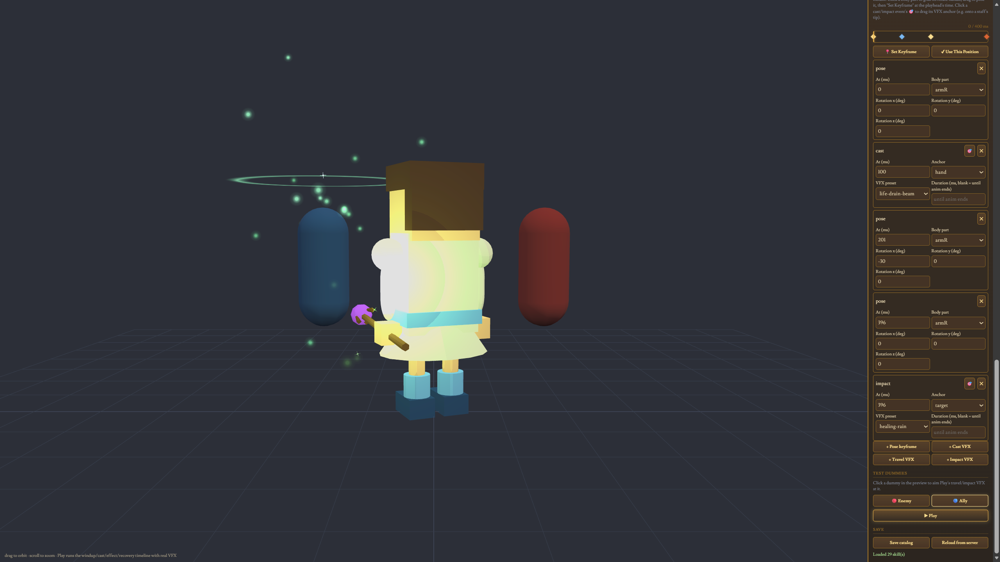

<p align="center">
  
</p>

# Slime MMORPG Builder

A work-in-progress **no-code MMORPG Builder** built with **JavaScript, Three.js, Express, and Socket.IO**.

Design complete MMORPG worlds directly in your browser: maps, terrain, NPCs, monsters, quests, skills, buildings, crafting, dungeons, events, particles and more—without writing game logic.



## ✨ Highlights

- 🌍 Full 3D World Editor
- 🏰 Building Editor
- 📃 100+ Assets, with the option to build your own, or upload FBX/GLB Models
- 👤 Character & NPC Editor
- 🗼 Dungeons and Tower Climbing Mode
- 👹 Monster Editor with animation tools
- ✨ Skill & VFX Editor with Status Logik (stun, taunt, slow, burn...)
- 📜 Quest, Dialogue & Event System
- ⚒️ Crafting, Gathering & Items
- 🗺️ Multi-map support with teleporters
- 🌊 Terrain, rivers, lakes and roads
- 🎨 Procedural asset generation
- 🌐 Server-authoritative multiplayer architecture


## 📸 Screenshots

| World Editor | Ingame |
|---|---|
|  |  |
| Monster Editor | Character Editor |
|  |  |
| Building Editor | Skill Editor |
|  |  |

## 🚀 What is it?

Slime MMORPG Builder is both a playable demo and a complete content creation toolkit. Almost every gameplay system can be authored visually through the browser. Content is stored as JSON and edited through dedicated builders instead of code.

> **Current status**
>
> The editor is already capable of creating rich MMORPG content. The networking, persistence, and production-ready MMO backend are still under active development.

## 🛠 Included Builders

- **World Editor** – terrain, water, roads, zones, objects, monsters, NPCs, quests, events and maps.
- **Building Builder** – modular building creation from primitive shapes.
- **Character Builder** – playable characters and NPCs.
- **Monster Editor** – stats, models, animations and abilities.
- **Skill Builder** – visual effects, animations and combat skills.
- **Character Creation** – player customization.

## 🏗 Architecture

- Shared client/server simulation
- Server-authoritative multiplayer
- Data-driven content
- Procedural asset generation
- Validation scripts for architecture, prefabs and VFX

## 💻 Tech Stack

- JavaScript
- Three.js
- Node.js
- Express
- Socket.IO

## 🚀 Getting Started

```bash
npm install
npm start
```

Open:

- `/` Ingame Preview
- `/editor.html` World Editor
- `/buildings.html` Create Buildings
- `/characters.html`Create NPCs and playable Characters
- `/skills.html` Create Skills for playable Characters

## 📌 Project Status

This is an actively developed solo project. Things like proper skill animations, sound effects and such are supported, but i didn't bother with them yet, since i'm focusing on the builders systems for now. A few assets are also visually broken, it has been too expensive to fix them so they will be fixed at a later point. 


## 🗺️ Roadmap
Not sure in which order, but features that will come in the future are: A lot of feature polishing for easier use, Better UI, AI NPCs who can quest, level etc, many more Assets, a Guuld System, saved Character progression, a proper landing page with logins and automatic switch to a Mobile UI.

See:

- `PROJECT_STATUS.md`
- `WORLD_BUILDER_ROADMAP.md`

for detailed progress and upcoming features.
